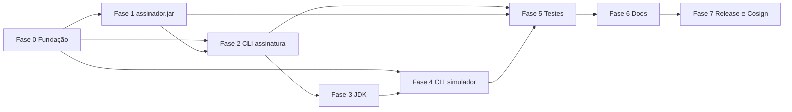

# Roadmap — Sistema Runner

Documento derivado de `especificacao.md`. Lista **macro tarefas** para execução e criação do software, em ordem lógica sugerida (paralelização possível onde indicado).

---

## Fase 0 — Fundação do projeto

| ID | Macro tarefa | Observações |
|----|----------------|-------------|
| R0.1 | Definir estrutura do repositório (monorepo ou módulos: CLI assinatura, CLI simulador, assinador Java) | Alinhar com entregáveis e build multiplataforma |
| R0.2 | Documentar decisões de arquitetura e **diagramas C4** (contexto e contêineres) | Referência na especificação; completar/evoluir `diagramas/` |
| R0.3 | Estabelecer convenções: versionamento **SemVer**, nomenclatura de artefatos, política de branches e releases | Base para GitHub Releases |
| R0.4 | Configurar ambiente de desenvolvimento documentado (JDK alvo, ferramentas de build do CLI) | Suporte Windows, Linux, macOS (amd64) |

---

## Fase 1 — Núcleo Java: `assinador.jar`

| ID | Macro tarefa | Observações |
|----|----------------|-------------|
| R1.1 | Implementar **interface de linha de comando** do Assinador (criar / validar assinatura, conforme referências FHIR da spec) | Escopo: simulação, não criptografia real |
| R1.2 | Implementar **validação rigorosa de parâmetros** (todos os campos exigidos pela especificação/referências) | Foco principal do esforço (US-02) |
| R1.3 | Implementar **simulação de criação** de assinatura (respostas pré-construídas para entradas válidas) | |
| R1.4 | Implementar **simulação de validação** de assinatura (resultado pré-determinado com regras simples) | |
| R1.5 | Integrar **PKCS#11** (interface com token/smart card) conforme critérios de aceitação | Sem implementação real de assinatura |
| R1.6 | Implementar **modo servidor HTTP** (warm start): subir serviço, receber requisições, alinhar contrato com o CLI | Porta padrão configurável |
| R1.7 | **Tratamento de erros e exceções**: mensagens claras, erros de parâmetros e falhas de execução | Propagação estruturada quando fizer sentido |
| R1.8 | Empacotar e versionar **`assinador.jar`** como artefato entregue junto ao código-fonte | |

---

## Fase 2 — CLI `assinatura` (multiplataforma)

| ID | Macro tarefa | Observações |
|----|----------------|-------------|
| R2.1 | Definir stack do CLI (linguagem/runtime) e biblioteca de parsing de argumentos / help integrado | Boas práticas de CLI na spec |
| R2.2 | Implementar comandos de **criação e validação** de assinatura com validação inicial no CLI | **Parcial (2026-04):** `criar`/`validar` disparam o JAR; checagens extras de arquivos/políticas no CLI ainda mínimas. |
| R2.3 | Implementar **invocação local**: executar `java -jar assinador.jar` (ou caminho configurado) com parâmetros corretos | **Feito (2026-04):** `RUNNER_ASSINADOR_JAR` ou `assinador.jar` ao lado do binário; `JAVA_HOME` ou `java` no PATH; stdout/stderr e código de saída. Cold start (US-01). |
| R2.4 | Implementar **invocação via HTTP**: cliente HTTP para o Assinador em modo servidor | Warm start (US-01) |
| R2.5 | Implementar **política de modo**: preferir servidor quando não orientado; permitir forçar local | |
| R2.6 | Implementar **detecção de instância** do Assinador já em execução na porta padrão (e reutilização) | |
| R2.7 | Implementar **início do servidor** na porta padrão quando ausente; **parada** na porta padrão ou indicada | |
| R2.8 | Implementar **encerramento programado** do Assinador após N minutos sem interação (quando solicitado) | |
| R2.9 | **Formatar e exibir** saídas legíveis; unificar tratamento de erros com mensagens acionáveis | Fluxos das seções 6.1 e 6.2 |

---

## Fase 3 — Provisionamento de JDK (US-04)

| ID | Macro tarefa | Observações |
|----|----------------|-------------|
| R3.1 | Especificar **versão mínima/recomendada** do JDK e estratégia de detecção no sistema | |
| R3.2 | Implementar **download e cache** do JDK compatível quando ausente | Windows, Linux, macOS |
| R3.3 | Integrar JDK provisionado às invocações do **Assinador** e do **Simulador** (`java` resolvido de forma consistente) | |
| R3.4 | Testar fluxos em **três plataformas** (instalação limpa vs. JDK já presente) | |

---

## Fase 4 — CLI `simulador` e ciclo de vida do HubSaúde (US-03)

| ID | Macro tarefa | Observações |
|----|----------------|-------------|
| R4.1 | Implementar **download do `simulador.jar`** a partir de **GitHub Releases** da disciplina (sempre versão mais recente) | Não desenvolver o JAR do simulador |
| R4.2 | Implementar **cache local**: não baixar se a versão mais recente já existir | |
| R4.3 | Implementar **início do Simulador** com verificação de **portas disponíveis** antes de subir | |
| R4.4 | Implementar **parada** e **comando de status** (em execução ou não) | |
| R4.5 | Alinhar mensagens, help e erros ao mesmo padrão de qualidade do CLI `assinatura` | |

---

## Fase 5 — Testes

| ID | Macro tarefa | Observações |
|----|----------------|-------------|
| R5.1 | **Testes unitários** (Assinador: validação, simulações; CLI: parsing, decisão de modo, formatação) | |
| R5.2 | **Testes de integração** (CLI ↔ JAR local; CLI ↔ HTTP; download JDK; download simulador) | |
| R5.3 | **Casos de erro** (parâmetros inválidos, portas ocupadas, falha de rede, processo morto) | |
| R5.4 | **Testes de aceitação** mapeados aos critérios das US-01 a US-05 | Checklists da especificação |

---

## Fase 6 — Documentação

| ID | Macro tarefa | Observações |
|----|----------------|-------------|
| R6.1 | **Manual de usuário** do CLI `assinatura` (comandos, modos local/servidor, exemplos) | |
| R6.2 | **Manual de usuário** do CLI `simulador` | |
| R6.3 | **Documentação técnica da integração** (fluxos, contratos HTTP se houver, variáveis/paths) | |
| R6.4 | **Guia de instalação** e requisitos; **exemplos de uso** ponta a ponta | |
| R6.5 | Manter **especificação** alinhada ao produto (incl. diagramas C4 atualizados) | Entregável explícito na spec |

---

## Fase 7 — Build, releases e segurança da cadeia de suprimentos

| ID | Macro tarefa | Observações |
|----|----------------|-------------|
| R7.1 | Pipeline de **build** para binários `assinatura` e `simulador` em **Windows amd64**, **Linux amd64**, **macOS amd64** | Formatos: .exe, AppImage, .dmg (conforme entregáveis) |
| R7.2 | Publicação em **GitHub Releases** com **checksums SHA256** por artefato | |
| R7.3 | Configurar **CI/CD** para gerar releases de forma reproduzível | |
| R7.4 | Automatizar assinatura com **Cosign** (OIDC, Sigstore), gerando para cada artefato: `<artefato>`, `.sig`, `.pem` | Obrigatório na spec |
| R7.5 | Documentar **verificação** com `cosign verify-blob` para usuários integradores | |
| R7.6 | (Se aplicável ao curso) Entrega do **código-fonte do Simulador HubSaúde** como item separado — apenas se for exigência acadêmica distinta do `simulador.jar` baixado | A spec lista como entregável 7; alinhar com orientador |

---

## Dependências resumidas

- **R2** depende de contrato mínimo de **R1** (CLI pode mockar até integrar).
- **R3** pode avançar em paralelo a **R2** após definir como o `java` é resolvido.
- **R7** concentra empacotamento, releases e Cosign após funcionalidades estáveis.

---

## Fora do escopo (lembrança)

Não incluir no roadmap: assinatura/validação criptográfica real, ACs, armazenamento persistente de assinaturas, GUI, autenticação de usuários, geração de certificados — conforme seção 4.2 da especificação.
